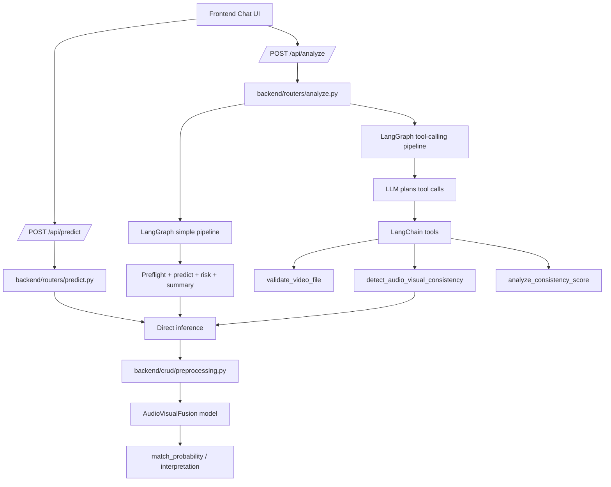

# LangGraph and Agentic Architecture Report

## Scope

This project exposes a FastAPI backend that serves two analysis paths for uploaded video clips:

- a deterministic rule-based pipeline built with LangGraph
- a tool-calling agent pipeline that uses LangChain tools and an LLM

Both paths share the same core model inference stack, so the main difference is orchestration, explanation quality, and how much autonomy the LLM has.

## High-Level Request Flow

## Backend Entry Points

### `backend/main.py`

The FastAPI app loads environment variables, enables CORS for the frontend dev servers, and registers both routers:

- `backend/routers/predict.py`
- `backend/routers/analyze.py`

It also exposes a lightweight `GET /health` endpoint.

### `POST /api/predict`

This is the direct inference endpoint in `backend/routers/predict.py`.

Behavior:

- accepts `file` and `video_kind`
- validates file size and `video_kind`
- saves the upload to disk
- calls `run_av_prediction(path, kind)`
- returns the raw detector output

This endpoint is the simplest path from upload to score.

### `POST /api/analyze`

This is the agentic endpoint in `backend/routers/analyze.py`.

Behavior:

- accepts `file`, `video_kind`, and `agent_mode`
- saves the upload to disk
- branches into one of two LangGraph workflows:
  - `agent_mode=simple`
  - `agent_mode=tool_calling`
- returns either structured analysis fields or an LLM-generated final response

This is the endpoint the frontend chat UI calls.

### `GET /health`

Returns a simple status payload for service checks.

## Simple LangGraph Pipeline

The deterministic path is built in `backend/agent/analysis_graph.py`.

Nodes:

1. `preflight_node`
   - checks file existence
   - validates basic upload metadata
   - records warnings in `validation.issues`

2. `predict_node`
   - calls `run_av_prediction(Path(saved_path), kind)`
   - stores the detector result in `prediction`

3. `assess_risk_node`
   - interprets the `match_probability`
   - assigns a coarse risk level and recommendation

4. `summarize_node`
   - if an LLM is configured, it writes a short explanation
   - otherwise, it falls back to a deterministic textual summary

Graph shape:

- `START -> preflight -> predict/fail -> assess_risk -> summarize -> END`

## Tool-Calling LangGraph Pipeline

The agentic path is built in `backend/agent/tool_calling_graph.py`.

Nodes:

1. `input_node`
   - converts upload metadata into a user prompt

2. `llm_node`
   - loads an LLM
   - prefers Grok when `GROK_API_KEY` is configured
   - falls back to Ollama when Grok is unavailable or fails
   - emits tool calls when the model chooses to use them

3. `tools_node`
   - executes tool calls from the LLM
   - keeps tool inputs grounded to the saved upload path
   - captures tool outputs as conversation messages

4. `final_node`
   - extracts the last assistant response as `final_response`

Graph shape:

- `START -> input -> llm -> tools -> llm -> final -> END`

This path is more flexible than the simple graph, but also more variable because the LLM decides how to sequence the tools.

## Tool Layer

The tools live in `backend/agent/tools.py`.

Available tools:

- `validate_video_file(file_path)`
- `detect_audio_visual_consistency(file_path, video_kind)`
- `analyze_consistency_score(score)`

These tools are wrappers around the same inference code used by the direct prediction endpoint, which means the detector is not duplicated.

## Shared Inference Stack

The core detector path is shared by all routes and tools.

1. `backend/crud/inference_crud.py`
   - `save_upload(...)` writes the file to the uploads directory
   - `predict_from_path(video_path, kind)` loads the model and runs inference
   - `run_av_prediction(...)` executes inference in a worker thread and deletes the temp file afterward

2. `backend/crud/preprocessing.py`
   - reads a center clip from the uploaded video
   - reads paired audio
   - branches preprocessing by `video_kind`
   - produces model-ready video and audio tensors

3. Model execution
   - loads the trained AudioVisualFusion checkpoint through `backend/crud/model_loader.py`
   - runs `model(video, audio)`
   - converts the logits to a `match_probability`

## How `video_kind` Changes Behavior

The selected `video_kind` determines preprocessing, not the endpoint.

- `youtube`
  - face-centric path
  - tries MTCNN-based face crop on an anchor frame
  - falls back to resize if a face cannot be found

- `dataset`
  - clean-background path
  - full-frame resize with no face crop

Important consequence:

- both paths still use the same detector weights
- a dataset selection does not block the model from producing a high score
- if the clip still contains strong face and mouth motion, the detector can score it highly even in dataset mode

## Frontend Interaction

The frontend chat UI in `frontend/src/landing/ChatAnalyzer.jsx` sends uploads to `/api/analyze` and chooses the mode with the `agentMode` state.

Observed behavior:

- `tool_calling` mode returns `final_response` plus tool trace messages
- `simple` mode returns structured fields such as `match_probability`, `risk_level`, and `recommendation`

So the frontend does not call the model directly; it only sends the upload and selected options to the backend.

## End-to-End Summary

### `/api/predict`

- direct upload handling
- one inference call
- raw score returned

### `/api/analyze?agent_mode=simple`

- upload handling
- LangGraph validation + inference + risk assessment + summary
- deterministic output shape

### `/api/analyze?agent_mode=tool_calling`

- upload handling
- LLM plans tool usage
- tools call the same inference path
- final response is LLM-authored, with conversation trace available

## Operational Notes

- The backend deletes uploaded temp files after inference.
- The tool-calling pipeline can fall back from Grok to Ollama.
- The simple pipeline is the most stable option for repeatable evaluation.
- The tool-calling pipeline is the best fit when you want richer reasoning and a conversational explanation.

## Practical Interpretation

If the user selects `dataset` but uploads a YouTube-style clip, the system still runs inference because the detector always receives the saved file plus the selected `video_kind`. The score can still be high because the model may still see enough synchronised audio and visible facial motion after full-frame resizing.

That is why the current architecture benefits from a preflight mismatch check, which can warn when the selected mode does not match the video content.